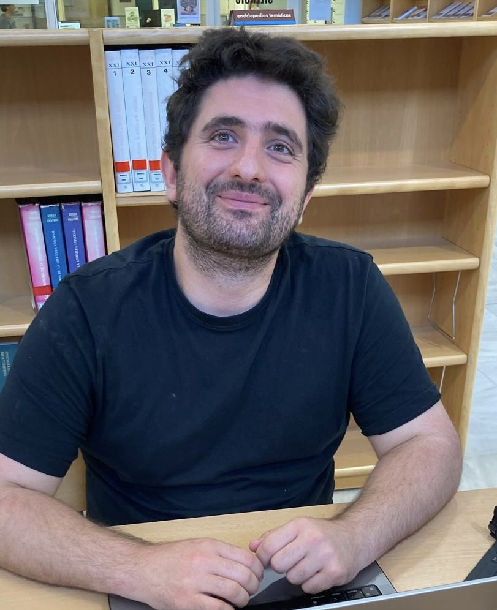

  

    
  

  

    <h1>Domènec Ruiz-Balet</h1>

    
I am an Assistant Professor (Professor Lector) at the Universitat de Barcelona and researcher at Centre de Recerca Matemàtica.

    

    My research lies in the mathematics of machine learning, at the interface of partial differential equations and dynamical systems. I work mainly on Neural ODEs, normalizing flows, and the mathematical analysis of transformer-based LLM architectures.
    I also have a secondary interest in mathematical economics, particularly mean-field games.
    

    

    You can reach me at:  
     📧 domenec.ruizibalet [at] ub [dot] edu  
     📍 Departament de Matemàtiques, Facultat de Matemàtiques i Informàtica, Gran Via de les Corts Catalanes, 585, 08007 Barcelona
    

  

