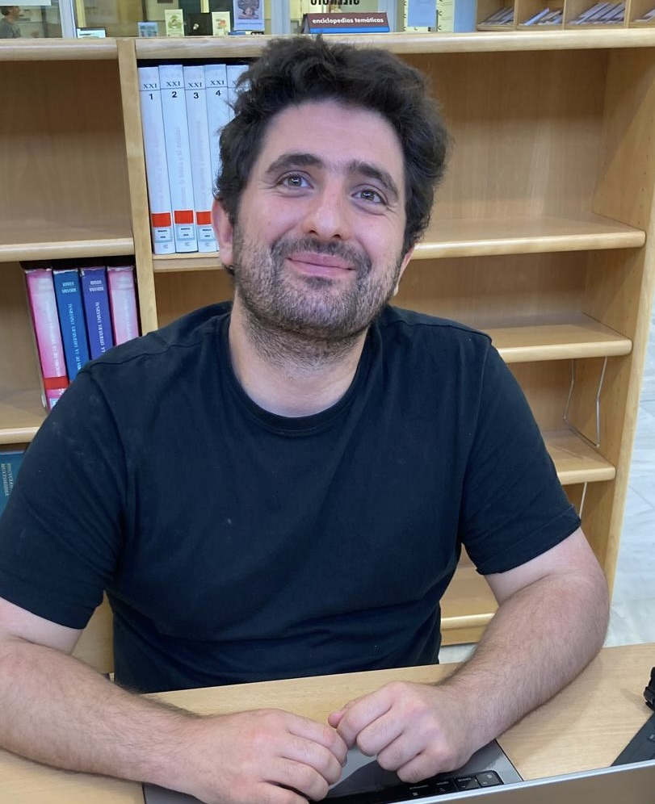

  

    
  

  

    <h1>Domènec Ruiz-Balet</h1>

    
I am an Assistant Professor (Professor Lector) at the Universitat de Barcelona.

    

    My research focuses on the mathematics of machine learning, particularly on areas at the intersection of partial differential equations and dynamical systems, such as deep neural networks and transformers.
    

    

    I am also interested in mathematical economics, especially in topics related to mean-field games and game theory more broadly.
    

    

    You can reach me at:  
     📧 domenec.ruiz [at] gmail [dot] com  
     📍 Departament de Matemàtiques, Facultat de Matemàtiques i Informàtica, Gran Via de les Corts Catalanes, 585, 08007 Barcelona
    

  

